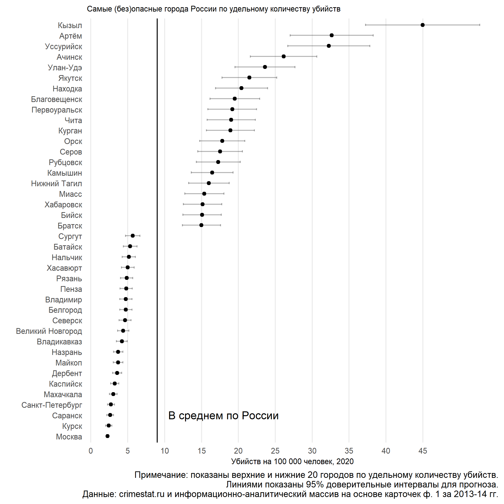

 

# Данные об убийствах в городах России   Homicides in Russian Cities

Данные об убийствах (возбуждённых уголовных делах по ст. ст. 105 и 111 ч.4 УК РФ), зарегистрированных в 140 городах России за 2013-2014 гг., численность населения этих городов, а также предсказанное удельное количество убийств по городам в 2020 г. Предсказанное удельное количество убийств (homicide rate) позволяет показать, какие города России являются наиболее опасными или безопасными с точки зрения летального насилия:

## Методология

### Удельное количество убийств в 2013-2014

Для расчёта количества убийств в 2013-2014 гг. я использую закрытые данные о всех зарегистрированных преступлениях (возбуждённых уголовных делах) в России[1](#fn1). Из них были отобраны все зарегистрированные преступления по статьям 105 и 114 ч.4 УК РФ, а затем агрегированы на уровне городов и городских округов страны по первым 6 цифрам ОКТМО. 

Для того, чтобы получить удельное количество убийств (то есть количество убийств, поделенное на население и умноженное на 100 000, или количество убийств на 100 000 человек населения), были использованы данные Росстата с разбивкой населения по населённым пунктам на 1 января 2016 г.[2](#fn2). Из данных были отобраны 176 городов России с населением свыше 100 тыс. человек на 2016 г. Нижняя граница выбрана по трём соображениям. Во-первых, в малых городах абсолютное количество убийств небольшое, что делает удельные оценки нестабильными. Во-вторых, точность сличения уменьшается с размером населённого пункта. В-третьих, сама логика удельного количества убийств на 100 000 человек подсказывает нам отсечку. 

Из 176 городов были сличены данные об убийствах из 140 городов. В информационно-аналитическом массиве отсутствуют полностью данные для Чечни, а также отсутствует идентификатор ОКТМО для Башкортостана, Кемеровской области, Хакасии, Сахалина, Ярославской области, Костромской области, Камчатского края. Другая проблема связана с муниципальными районами и их административными центрами: многие отделы МВД ответственны одновременно за город, в котором они расположены, и за муниципальным районом, который подчинён этому городу, но не является населённым пунктом. По этой причине было сделано сличение по первым 6 знакам ОКТМО, иначе удельное количество убийств завышается: поскольку для города N в числителе будут убийства и в городе N, и в N-ском муниципальном районе, а в знаменателе -- население только города N. По этой причине в данных об убийствах отсутствуют многие города Московской области. 

### Предсказанное количество убийств в 2020

Используя данные Портала правовой статистики Генеральной прокуратуры (crimestat.ru) по суммарному количеству убийств (зарегистрированные ст.ст. 105, 106, 107 УК РФ включая приготовление и покушение на преступление (ст. 30 УК РФ), а также зарегистрированные ст. 111 ч.4) в субъектах РФ и панельные данные по населению регионов из Росстата, я строю линейную регрессию удельного количества убийств в регионе на год для каждого региона, получая 83 линии тренда удельного количества убийств за 2009-2019 гг. Используя отношение удельного количества убийств в каждом регионе из 2014 г. к предсказанному в 2020 г., я получаю множитель, который позволяет предсказать удельную убийственность городов из 2013-2014 г. в 2020 г. Важное предположение здесь заключается в том, что тренд снижения преступности в городах следует тренду на уровне региона.

Отдельная поправка -- убийственность в Москве. Данные информационно-аналитического массива по убийствам в Москве кажутся совершенно не надежными из-за заниженности, поэтому в качестве удельного количества убийств в Москве в 2020 г. я использую линейный прогноз на 2020 г. на данных crimestat.ru. Это завышает показатель для Москвы, поскольку удельное количество убийств из информационно-аналитического массива немного меньше, чем из данных crimestat.ru.

Разумеется, данный прогноз заведомо менее точен, чем реальные данные об убийствах в городах в 2019 г., но более свежих открытых данных, насколько мне известно, не существует. По этой причине я указываю 95% доверительные интервалы для прогноза. Кроме того, официальная криминальная статистика в России страдает от того, что многие преступления никогда не становятся возбуждёнными уголовными делами. Убийства наименее подвержены этому. Тем не менее, статистика убийств всё равно может быть занижена, например, из-за того, что потерянные без вести, будучи убитыми и никогда не найденными, не попадают в эту статистику (см. анализ надёжности российской статистики убийств в [Lysova 2018](https://journals.sagepub.com/doi/abs/10.1177/1477370818794124)). 

### Убийства и тяжкий вред здоровью

Мы также отдельно посчитали, сколько зарегистрировано преступлений по частям 1-3 статьи 111 УК РФ, и рассчитали отношение количества убийств к сумме убийств и преступления, связанных с нанесением тяжкого вреда здоровью. Это позволяет исследователям смотреть на то, какие факторы в городах связаны с превращением нелетального физического насилия в летальное.

## Описание переменных в данных

Файл `homicide_rate_cities_russia_2020.csv` в кодировке UTF-8 содержит 140 наблюдений и 13 переменных.

| Переменная / Variable | Описание | Description |
|----------------------------|-----------------------------------------------------------------------------------------|----------------------------------------------------------------------------|
| `region` | Субъект РФ | Region |
| `city` | Название города | City |
| `population` | Население города (на 1.01.2016 г.) | City population (as of 1 Jan 2016) |
| `adjusted_homicide_rate` | Предсказанное удельное количество убийств в 2020 г. | Predicted homicide rate in 2020. |
| `homicide_to_injury_ratio` | Отношение количества убийств к сумме убийств и тяжкого вреда здоровью. | Ratio homicides / (homicides + grave_injuries). |
| `homicides` | Количество умышленных убийств (ст.ст. 105 и 111 ч.4 УК РФ) за 2013-2014 гг. | Homicides in 2013-2014 |
| `grave_injuries` | Количество преступлений, связанных с тяжким вредом здоровью (ст.111 ч.1-3 УК РФ) за 2013-2014 гг. | Grave injuries (Art. 111 parts 1-3) in 2013-2014. |
| `unadjusted_homicide_rate` | Удельное количество убийств (`homicides / 2 / population * 100000`) в 2013-2014 гг. | Homicide rate (`most_homicides / 2 / pop * 100000`) in 2013-2014. |
| `multiplier` | Множитель, показывающий изменение удельного количества убийств с 2014 по 2020 г. | Multiplier shows the projected change of homicide rates from 2014 to 2020. |
| `multiplier_upr` | Верхняя граница 95% доверительного интервала множителя. | Upper bound of multiplier 95% confidence interval. |
| `multiplier_lwr` | Нижняя граница 95% доверительного интервала множителя. | Lower bound of multiplier 95% confidence interval. |
| `adjusted_homicide_rate_upr` | Верхняя граница 95% доверительного интервала предсказанного удельного количества убийств в 2020 г. | Upper bound of predicted 2020 homicide rate 95% confidence interval. |
| `adjusted_homicide_rate_lwr` | Нижняя граница 95% доверительного интервала предсказанного удельного количества убийств в 2020 г. | Lower bound of predicted 2020 homicide rate 95% confidence interval. |

## Условия использования

  
Данные опубликованы под лицензией <a rel="license" href="http://creativecommons.org/licenses/by/4.0/">Creative Commons Attribution 4.0 International License</a>. Вы можете их свободно использовать при условии цитирования:

Данные об убийствах в городах России, 2020. Институт проблем правоприменения при Европейском Университете в Санкт-Петербурге. URL: https://github.com/irlcode/Russian_cities_homicide_data

## Контакты
Алексей Кнорре

Институт проблем правоприменения при Европейском Университете в Санкт-Петербурге

aknorre@eu.spb.ru

_________________________________
<a name="fn1">1</a>: информационно-аналитический массив на основе статистических карточек формы 1, предоставленный Институту проблем правоприменения при ЕУСПб Генеральной прокуратурой РФ; этот массив был использован и описан в исследованиях наркопреступлений в России, например, «[Как МВД и ФСКН борются с наркотиками](https://enforce.spb.ru/images/analit_zapiski/FSKN_MVD_memo_2015_web.pdf)».

<a name="fn2">2</a>: это единственный год, где в данных Росстата каждому населённому пункту соответсвует идентификатор ТЕРСОН-МО, копирующий ОКТМО.
